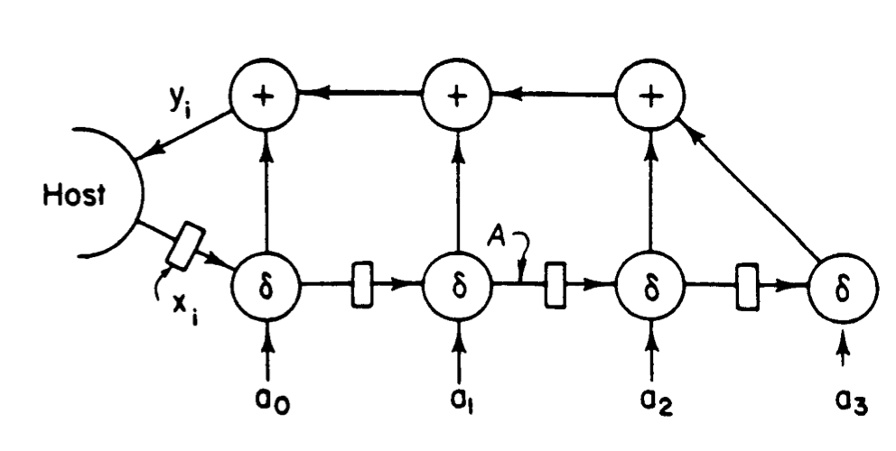
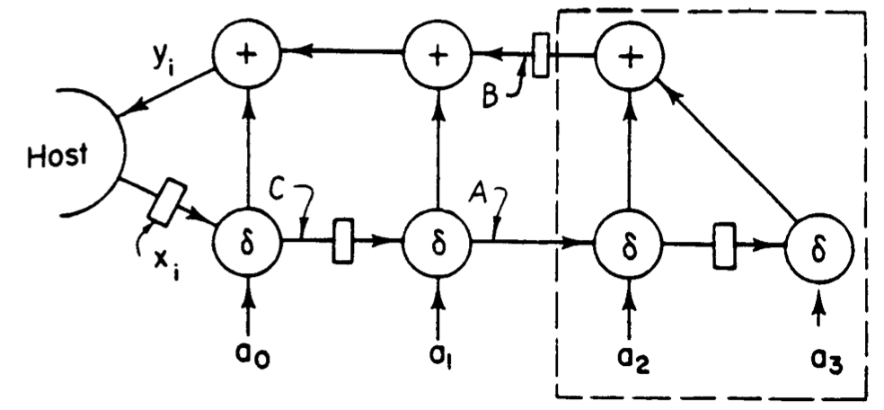
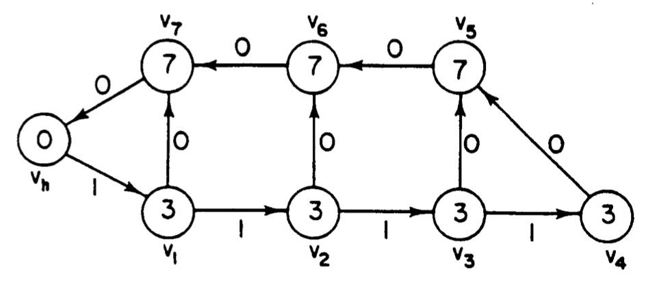
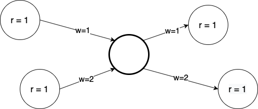
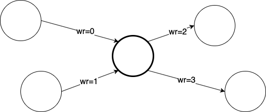
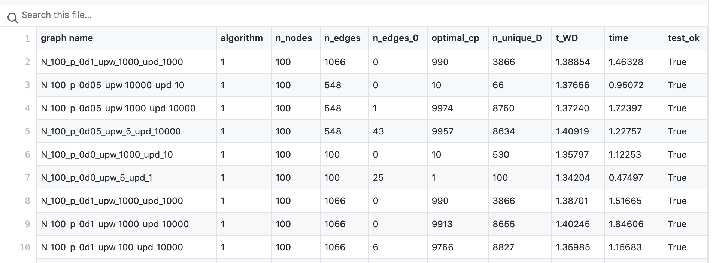

# Retiming synchronous circuitry implementation

This repository contains a Python 3 implementation of the paper [Retiming synchronous circuitry](https://people.eecs.berkeley.edu/~alanmi/courses/2008_290A/papers/leiserson_tech86.pdf) by Leiserson and Saxe.
The first part of the readme (until the section "Algorithms to be implemented" included) is a summary of the original paper with an highlight to the theoretical details relevant to the implementation. The second part is about the actual implementation.

## The problem

### Introduction
The goal is to decrease as much as possible the clock period of a synchronous circuit by means of a technique called _retiming_, that does not increase latency. One example is the following of the digital correlator, taken from the original paper. The correlator takes a stream of bits x<sub>0</sub>, x<sub>1</sub>, x<sub>2</sub>, ... as input and compares it with a fixed-length pattern          a<sub>0</sub>, a<sub>1</sub>, ... a<sub>k</sub>. After receiving each input x<sub>i</sub> (i &ge; k), the correlation produces as output the number of matches:

<p align="center">
     y<sub>i</sub> = Σ<sup>k</sup><sub>j=0</sub>  δ(x<sub>i − j</sub>, a<sub>j</sub>) ,
</p>

where δ(x, y)=1 if x=y, and  δ(x, y)=0 otherwise (comparison function).
The following figure shows a design of a simple correlator for k = 3.
<p align="center">
    
</p>
Suppose that each adder has a propagation delay of 7 esec (a fictitious amount of time), and each comparator has a delay of 3 esec. Then the clock period must be at least 24 esec, i.e. the time for a signal to propagate from the register on the connection labeled A through one comparator and three adders. 
Better performance can be reached by removing register on connection A and inserting a new register on connection B, as shown in the following figure.
<p align="center">
    
</p>
The clock period now is decreased by 7 esec. 

**Retiming** is the technique of inserting and deleting registers in such a way as to preserve function, and it can be used to produce faster circuits.


### Preliminaries

Circuits are modelled as graphs, as shown in the figure below, where there is the graph of the first correlator. 
<p align="center">
    
</p>

Each vertex is weighted with its propagation delay *d(v)*, while each edge is weighted with its register count *w(e)*.
In the following they are called **delay** and **weight**.
A simple path p is a path from a vertex to another that contains no vertex twice. The notion of delay *d*(*p)* and weight *w*(*p)* for paths as the sum of delays of the vertices in the path and the sum of weights of the edges in the path.

#### Constraints for physical feasibility
* **D1.** d(v) nonnegative for each vertex
* **W1.** w(v) nonnegative integer for each edge
* **W2.** In any directed cycle of G, there exists at least one edge e with w\(e\)&gt;0.

#### CP algorithm
This is an algorithm that computes the clock period of a circuit. The clock period is defined as:
<p align="center">
    cp(G)=max{d(p) : w(p)=0}
</p>

**Algorithm CP:**
1. Let G0 be the G subgraph with only those edges e with w(e)=0
2. By **W2.**, G0 is acyclic. Perform a topological sort such that vertices are totally ordered with respect to the edges (if u -> v, then u<v). 
3. Visit vertices in that order, for each v compute Δ(v) as follows:
	* If no in_edge(v), Δ(v):=d(v)
	* otherwise, Δ(v):=d(v)+max{Δ(u): u is incoming to v with edge e and w(e)=0}
4.  cp(G) = max<sub>v</sub> Δ(v)

Running time is O(|E|).

### Retiming

A retiming is a function r that assigns to each vertex an integer (positive or negative) r(v). It specifies a transformation to a new graph G<sub>r</sub> that has the same vertices, edges and delays, but different weights such that for each edge e that links u to v,  w<sub>r</sub>(e)=w(e)+r(v)-r(u).

#### Condition for a legal retiming
It can be proved that a retiming r is legal if G<sub>r</sub> satisfies W1.

## Algorithms to be implemented

### WD
Algorithm to compute the matrices W and D (shape: |V| x |V| ), defined like this:
* W(u,v) = min{w(p): u -p-> v} (minimum number of registers in a path between u and v)
* D(u,v) = max{d(p): u-p->v and w(p)=W(u,v)}

The theoretical details of this algorithm are not relevant for the implementation, for more about the implementation details see the doc.
### OPT1
Algorithm that given a circuit G, returns the optimal cp and the corresponding retiming r.
First, it is important to say that the following **conditions for a legal retiming** can be proved:
1. r(u)-r(v) &le; w(e) for every edge u-e->v AND
2.  r(u)-r(v) &le; w(e) for all vertices u,v such that D(u,v) &gt; c.

**OPT1 algorithm:**
1. Compute W and D with WD algorithm
2. Sort the elements in the range of D
3. Binary search among the elements of D for the minimum achievable cp, to test whether each potential clock period c is feasible, apply the Bellman-Ford algorithm to determine if the conditions for a legal retiming can be satisfied.
4. For the minimum achievable clock period, use the values for the r(v) found by BF.

Running time: O( |V|<sup>3</sup>lg(|V|) )

**BF algorithm:**
Algorithm that solves a set of linear inequalities.
 1. Create a graph with a vertex for every variable and such that for every inequality x<sub>j</sub> - x<sub>i</sub> &le; b<sub>k</sub> there is an edge from i to j with weight b<sub>k</sub>.
 2. create a new node *start* linked with all the others with weight 0
 3. find the shortest paths from *start* to all the other nodes with [Bellman-Ford](https://en.wikipedia.org/wiki/Bellman–Ford_algorithm). If BF fails, the set of inequalities is unsolvable, if BF finds all the shortest paths, then the cost of the shortest-path(*start*, i) is a feasible assignment to x<sub>i</sub>.

This is a general theoretical description. For the actual implementation in our particular case, see the docs.

### OPT2
Like OPT1, but the test of feasibility is done with FEAS algorithm, which is described below. Running time: O( |V| |E| lg(|V|) )

**FEAS**
Check if a certain clock period c is feasible.
1. For each vertex v, set r(v):=0
2. Repeat for |V|-1 times:
	* Compute G<sub>r</sub> from r
	*  Run CP algorithm on  G<sub>r</sub> to determine Δ(v) for each v
	* For each v s.t. Δ(v)>c, set r(v):=r(v)+1
3. Run CP algorithm on  G<sub>r</sub>. If cp( G<sub>r</sub>)>c, then c is not feasible. Otherwise c is feasible and r is the desired retiming.  
## Algorithms implementation

Docs are already compiled in the *doc* directory. Open [doc/build/html/index.html](doc/build/html/index.html) in any browser for the documentation index.
The implementation relies on the [NetworkX](https://networkx.github.io) library to build graphs, and uses the wrapper pattern to wrap the DiGraph object of NetworkX (for directed graph) within another object that implements the algorithm to be implemented and other auxiliary methods. The two main classes are GraphWrapper \([doc here](doc/build/html/GraphWrapper.html)\) and NewGraphWrapper \([doc here](doc/build/html/NewGraphWrapper.html)\). 
The first was used for OPT1 and OPT2, but a better version of OPT2 is contained in NewGraphWrapper. Also, in GraphWrapper there are some auxiliary function useful to create random tests such that:
* check_legal_retimed_graph: checks if the graph is legal after retiming, i.e. if all the w(e)>=0 (condition W1.).
* set_retimed_graph: applies the retiming r on the graph if it's legal. Check done with check_legal_retimed_graph.

Other useful functions are in utils.py.
For the details about OPT1 and OPT2, see the docs for GraphWrapper and NewGraphWrapper.


## Requirements
In this implementation were used:
* **Python**: version 3.7.4. 
* **Pip**: version 20.1.1.

It is suggested to use a [python virtual environment](https://docs.python.org/3/library/venv.html).

After activating the virtual environment, install python dependecies with the following bash command:
```shell script
pip install -r requirements.txt
```
## Test creation

Graph to be tested generated random with the file test_generator.py (see the docs for details).
To run the graph test generator:
```shell script
python3 test_generator.py
```
The rationale of the creation of the tests is: by definition of the clock period, if we have a circuit with any edge e s.t. w(e)&ge;1, we know a priori that the optimal cp is max<sub>v</sub>d(v). After the creation of a random graph with this condition though, we want to randomise the graph in order to be difficult for OPT1/2 to find the retiming requested, therefore we exploit the retiming property that says that a retiming does not change the function of the circuit. Therefore we create a random retiming (and change the structure of the graph) in order to create the test graphs.
### Random retiming legal by construction
This is done by the function in utils.py called random_retime. It finds, for each node, the lowerbound and the upperbound for the retiming of that node, and then  
chooses a random integer between LB and UB.  
Here is how the bounds are found:  
  
1. set r(v):=0 for each v  
2. For each node v:  
	 * find what is the minimum retimed incoming weight min_in_w_r  
	 * find what is the minimum retimed outcoming weight min_out_w_r  
3. The retiming is a random integer number between (-min_in_w_r, min_out_w_r)

An example is in the figure below.

<p align="center">
    
</p>

Let's try to find the retiming for the central highlighted node. First we have to calculate the temporary retiming for the incoming and outcoming edges:

<p align="center">
    
</p>

Now we see that min_in_w_r=0, while min_out_w_r=2. Therefore the interval is (0, 2). Let's try to set a retiming lower than the LB, for instance -1. From the formula of the retiming, the edge with wr=0 would have a new wr=-1, that violates W1. The same is if we try to set a retiming higher than 2.

### Run selected tests

To run some selected tests, create a folder called selected_tests:
```shell script
mkdir selected_tests
```
and move some test graphs in there. Then, run:

```shell script
chmod +x run_selected_tests.sh
./run_selected_tests.sh
```


## Assessment and Profiling

To profile the code with cProfile, change the name of the file you want to run in the file time_profile.sh. Then:

```shell script
chmod +x time_profile.sh
./time_profile.sh
```
will open a window in your browser. This visualisation was used to optimise iteratively the code of OPT2.

Profiles made with cProfile are in the [profile](profiles/) folder. In order to visualise a profile, the command is:
```shell script
snakeviz path-to-the-file
```
From those profile is clear the improvement of the NewGraphWrapper implementation of OPT2 (its profile is [here](profiles/N_200_p_0d75_upw_1000_upd_1000_algo3.profile)) from the GraphWrapper one (profiled [here](profiles/N_200_p_0d75_upw_1000_upd_1000_algo2.profile)).

The time analyisis of the algorithms is in [Test/stat_files/test.csv](Test/stat_files/test.csv), a preview is reported below. Note that the field "algorithm" can have values 1, 2, 3. 1 means OPT1, 2 means OPT2 old implementation and 3 means OPT2 new implementation. In total, there are about 500 random tests in the csv and all the algorithms implemented passed them successfully.

<p align="center">
  <a href="Test/stat_files/test.csv">
    
  </a>
</p>

